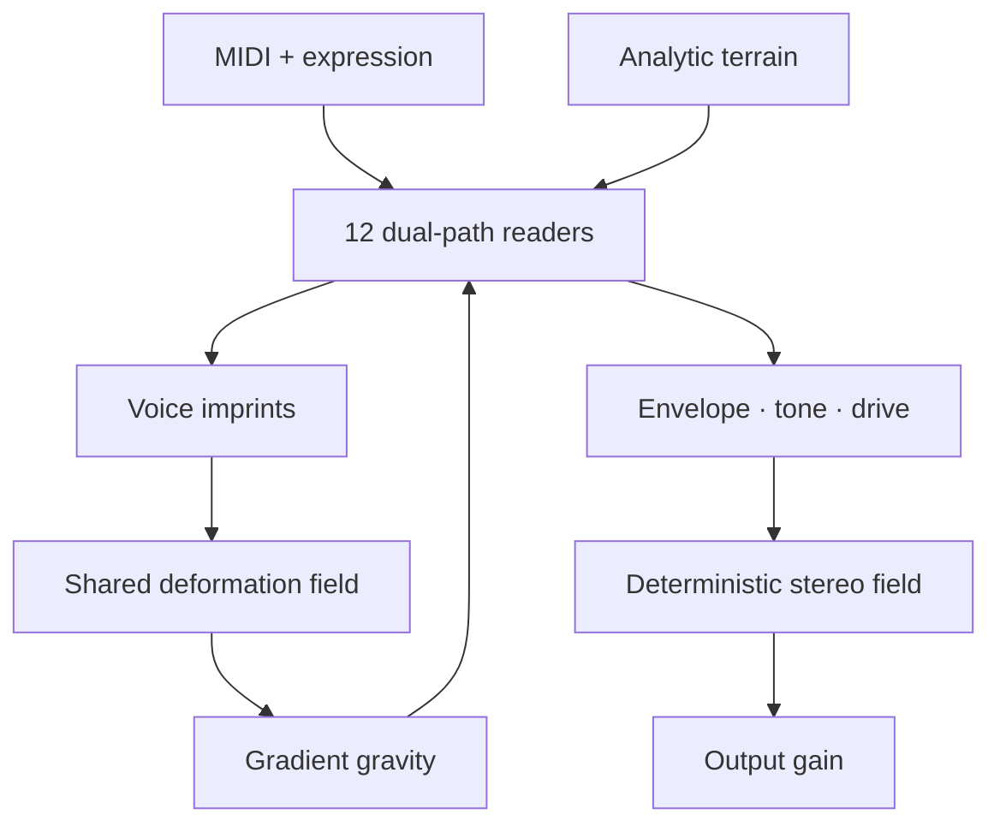

# Wavoria engine architecture

## The evolutionary step

Historical wave-terrain synthesis reads a two-dimensional path through a fixed function and uses the sampled height as audio. That is the seed of Wavoria, not its finished architecture.

Wavoria turns the fixed function into a shared, stateful performance space:

1. MIDI creates a **reader**, not a conventional oscillator.
2. The reader follows a primary trajectory plus an interacting satellite trajectory.
3. Both trajectories sample the analytic terrain and the shared deformation field.
4. The field gradient pulls trajectories toward or away from accumulated geometry.
5. Each sounding reader deposits a velocity-, expression-, and envelope-dependent imprint.
6. All voice imprints are accumulated after the sample is read, so a chord writes one coherent field.
7. Memory determines how long that geometry remains available to later notes.

This creates causal musical behavior: what was played changes what can be heard next.

## Signal path

## Terrain model

The base surface continuously morphs through four mathematical families:

| Region | Character | Typical use |
|---|---|---|
| Dunes | Broad coupled ridges | bass, pads, rounded leads |
| Basins | Radial wells and rings | bells, struck tones, vocal motion |
| Lattice | Intersecting harmonic grids | plucks, keys, precise spectra |
| Crystal | Angular compound planes | metallic, complex, cinematic material |

`Contour`, `Fold`, and `Symmetry` reshape the selected topology without switching the engine into a different synthesis method.

## Shared field

The deformation field is an 18 × 18 audio-thread-owned grid. Readers use bilinear sampling and deposit into the four nearest cells. Maintenance runs every 32 samples, providing exponential memory from approximately 60 ms to 48 seconds without scanning the grid for every voice on every sample.

The grid is deliberately shared at processor level. A voice-local field would produce animated notes, but it would not allow chords or sequential phrases to alter one another.

## Trajectories

The primary reader morphs between a circle and a 2:3 Lissajous path. A phase-offset satellite reader follows a related 3:2 path with a breathing radius. `Interaction` moves from a primary read, through two-reader blending, toward multiplicative coupling. `Drift` translates the orbit slowly through the world.

The fundamental path phase remains locked to note frequency. Slow drift and field deformation add living variation without discarding pitch identity.

## Expression

- Velocity scales output and imprint depth.
- Poly aftertouch and channel pressure increase field imprint and open the tone path.
- Mod wheel supplies a global expression source when pressure is unavailable.
- Pitch bend is ±2 semitones.
- Sustain retains readers while released keys continue to write the shared field.
- Stereo width distributes the reader ensemble around an anchored constant-power field; a single reader always remains audible in both channels.

## Real-time constraints

- No allocation, locking, file access, or runtime AI is used on the audio thread.
- UI state crosses the audio/UI boundary through relaxed atomics.
- Reader imprints are applied after all voices are sampled for a frame, avoiding voice-order feedback within that sample.
- The field is transient performance state; preset/state recall stores parameters and seed, not a frozen audio-history grid.
